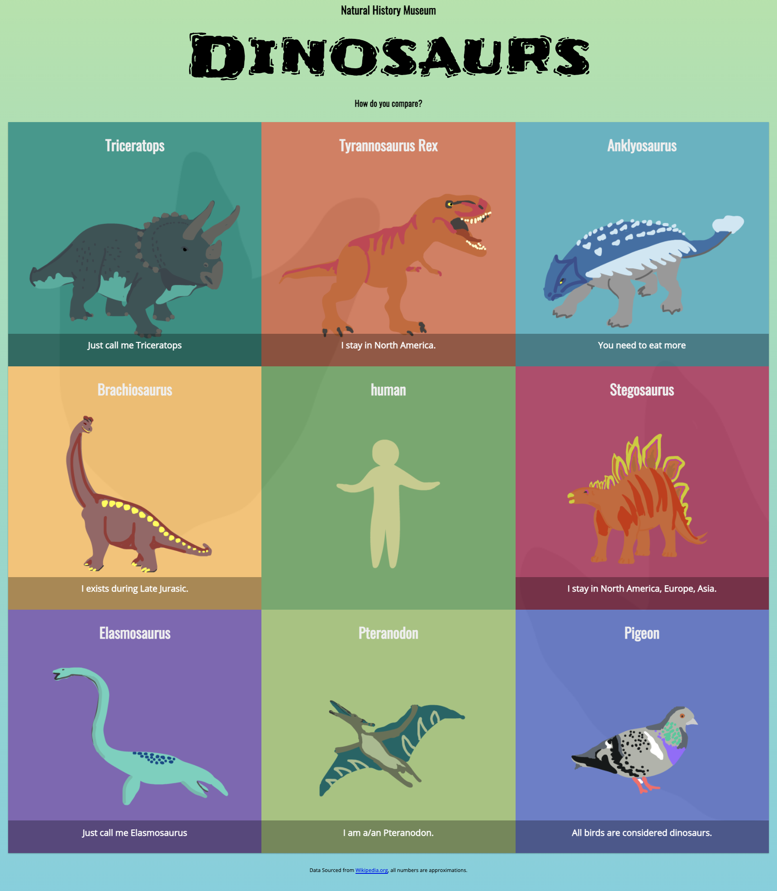

# Dinosaurs - an Object Oriented Javascript

## Notes:
1. There are several way to create object and to create inheritance in javascript 
2. I will try to explore all of it in this exercise

### Object inheritance
There are 4 big category in this project, I will try to use different way to do inheritance in javascript:
1. Being -> it will use `function` syntax
2. Dino -> it will use `function prototype` | inherit from Being
3. Human -> it will use `class extends` syntax | inherit from Dino
4. pigeon -> will use `Factory pattern with Object create` syntax | inherit from Dino

